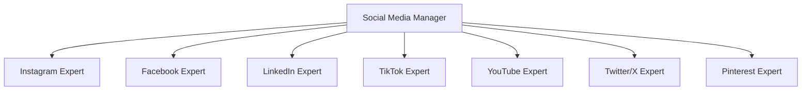

# Equipa de Agentes - Redes Sociais

Este diretório contém os agentes especializados em redes sociais para criação de conteúdo e estratégias multi-plataforma.

## Estrutura da Equipa

```
agentes_open_code/
├── social-media-manager.md    # Director/Coordenador da equipa
├── social-instagram.md        # Especialista em Instagram
├── social-facebook.md         # Especialista em Facebook
├── social-linkedin.md         # Especialista em LinkedIn
├── social-tiktok.md           # Especialista em TikTok
├── social-youtube.md           # Especialista em YouTube
├── social-twitter.md          # Especialista em Twitter/X
└── social-pinterest.md        # Especialista em Pinterest
```

## Hierarquia



## Funções

| Agente | Especialização | principais Plataformas |
|--------|---------------|----------------------|
| `social-media-manager.md` | Director/coordenador | Todas |
| `social-instagram.md` | Conteúdo visual, Reels, Stories | Instagram |
| `social-facebook.md` | Pages, Groups, Ads, Marketplace | Facebook |
| `social-linkedin.md` | B2B, thought leadership, Ads | LinkedIn |
| `social-tiktok.md` | Vídeos curtos, trends, viral | TikTok |
| `social-youtube.md` | Long-form, Shorts, SEO video | YouTube |
| `social-twitter.md` | Threads, tweets, real-time | Twitter/X |
| `social-pinterest.md` | SEO visual, pins, shopping | Pinterest |

## Como Usar

1. **Iniciar com o Director** - O `social-media-manager.md` é o agente principal que coordena a estratégia
2. **Delegar para Especialistas** - Para conteúdo específico de cada plataforma, usar os agentes especializados
3. **Estratégia Integrada** - O manager compila sugestões de todos os especialistas

## Notas

- Todos os agentes têm `temperature: 0.7` (criativo mas consistente)
- Ferramentas disponíveis: edit, bash, websearch, webfetch
- Modo: subagent (para usar com Task tool)